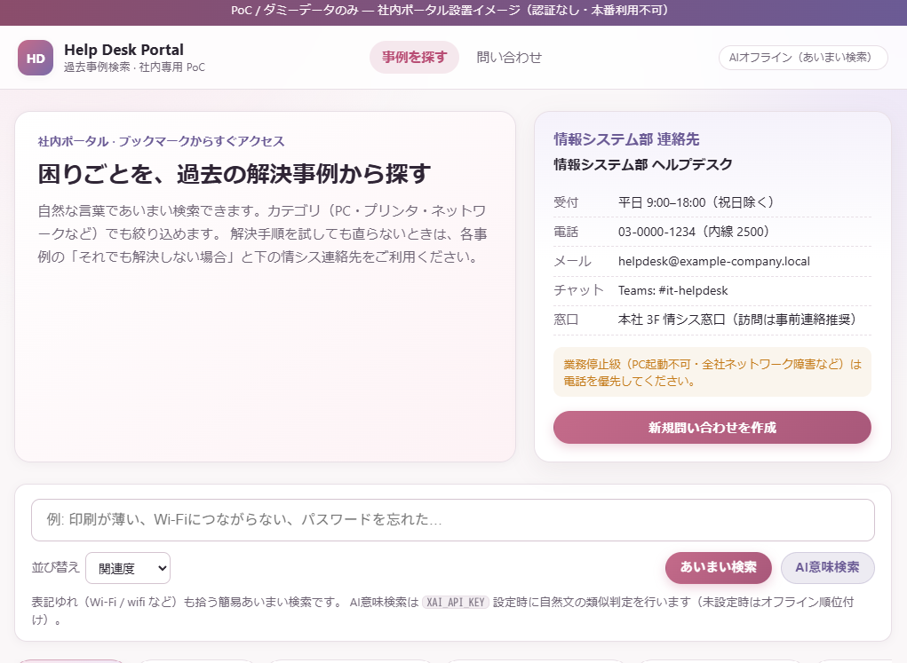
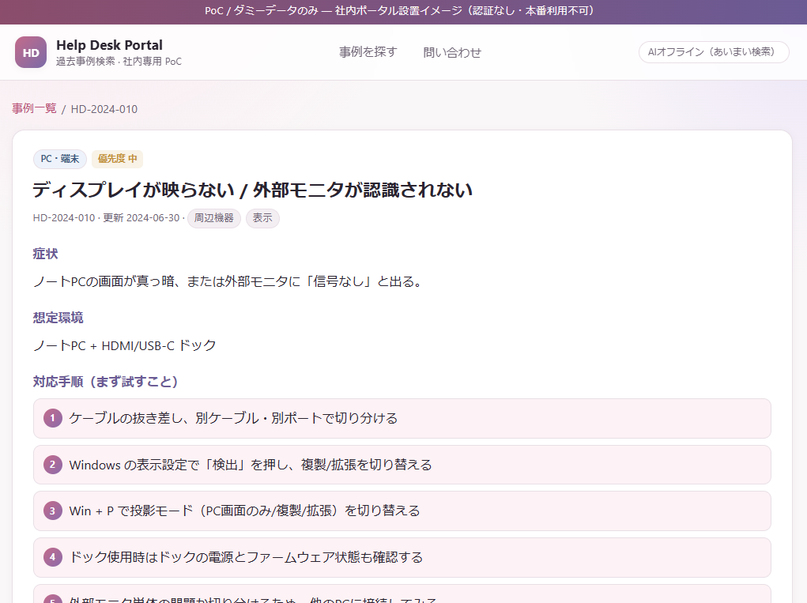
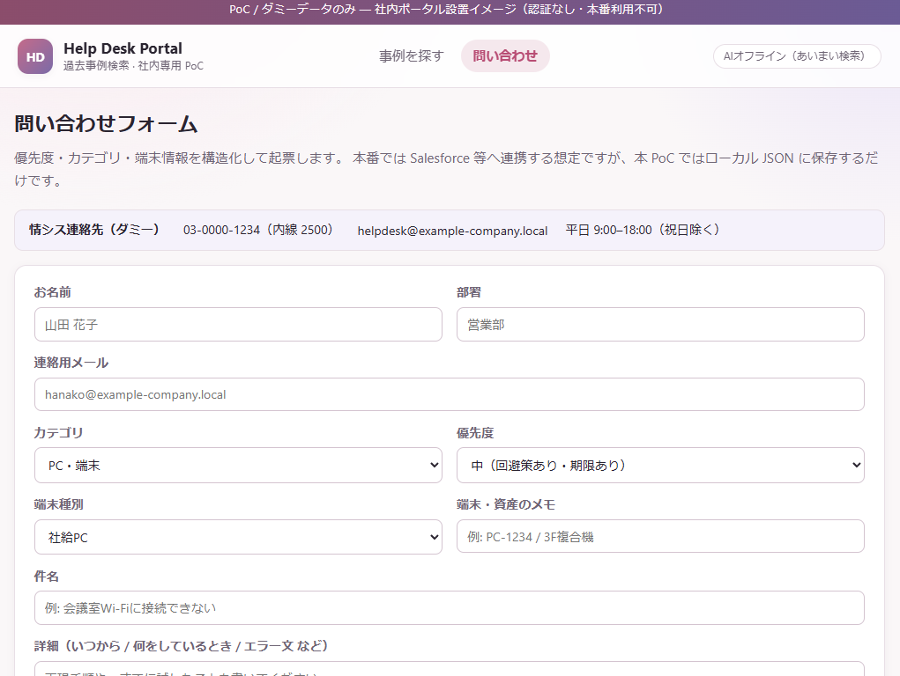

# 社内ヘルプデスク 過去事例検索ツール（PoC）

社内ポータル向けの **過去問い合わせ事例検索** プロトタイプです。  
自然文でのあいまい検索・任意の AI 意味検索、カテゴリ別一覧、構造化問い合わせフォームを備えます。

想定利用: 社内ポータルに設置し、社員が Chrome のブックマークからアクセスするイメージです。  
**データはすべて架空のダミー**です。実在の個人・組織の情報は含みません。

---

## スクリーンショット

### 1. トップ（検索・連絡先）

検索ボックス、カテゴリ導線、情報システム部の連絡先カードを配置した一覧入口です。



### 2. 事例詳細（対応手順）

症状・想定環境・番号付きの対応手順を表示します。画面下部には「それでも解決しない場合」とエスカレーション導線があります。



### 3. 問い合わせフォーム

優先度・カテゴリ・端末情報などを構造化して起票します（PoC ではローカル JSON に保存のみ）。



---

## 機能

| 機能 | 内容 |
|------|------|
| **あいまい検索** | 自然な言葉・表記ゆれ（Wi‑Fi / wifi など）で事例を絞り込み |
| **AI意味検索** | 任意で xAI API による類似事例ランキング（未設定時はオフライン順位付け） |
| **カテゴリタブ** | PC・プリンタ・ネットワーク・アカウント・ソフトウェア など |
| **並び替え** | 関連度 / 優先度 / 更新日 / タイトル |
| **事例詳細** | 症状・手順・**それでも解決しない場合**・よくある決着 |
| **情シス連絡先** | トップに受付時間・電話・メール・チャット（ダミー） |
| **問い合わせフォーム** | 優先度・カテゴリ・端末情報を構造化してローカル保存 |

本番ではチケット管理システム（Salesforce 等）と連携する想定ですが、本 PoC は **JSON ファイル** で完結する最小構成です。

---

## 制限事項

- **ダミーデータ**です。本番ヘルプデスク運用には使わないでください  
- **認証なし**です。到達できる人は操作できます（本番では SSO 等を前提）  
- ブックマークだけではサーバは動きません。**プロセスの起動が必要**です  
- 問い合わせ送信は `data/inquiries.json` への追記のみ（外部通知なし）  
- AI 利用時は事例テキストが API に送られます。本 PoC はダミーのみ送信  

---

## 起動方法

### かんたん起動（Windows）

このフォルダで次をダブルクリックします。

| ファイル | 動作 |
|----------|------|
| **`ヘルプデスクを開く.bat`** | サーバ起動 → ブラウザで http://127.0.0.1:8001 を開く |
| **`ヘルプデスクを終了.bat`** | サーバ停止 |

- 実装: `open_console.py` / `stop_console.py`  
- 初回のみ仮想環境作成と `pip install`  
- 待受: **127.0.0.1:8001**  

### コマンドで起動

```powershell
cd <このリポジトリのパス>
python -m venv .venv
.\.venv\Scripts\Activate.ps1
pip install -r requirements.txt
uvicorn app.main:app --host 127.0.0.1 --port 8001
```

ブラウザ: http://127.0.0.1:8001

### AI意味検索（任意）

```powershell
copy .env.example .env
# .env に XAI_API_KEY=... を設定
```

- キー取得: https://console.x.ai  
- 未設定でも **あいまい検索**だけで動作します  

---

## ダミー事例（12件）

| ID | カテゴリ | タイトル例 |
|----|----------|------------|
| HD-2024-001 | PC | 電源が入らない / 起動しない |
| HD-2024-002 | ネットワーク | 社内 Wi‑Fi に接続できない |
| HD-2024-003 | プリンタ | 印刷が薄い・かすれる |
| HD-2024-004 | プリンタ | コピー機がエラーで使えない |
| HD-2024-005 | アカウント | パスワード忘れ / ログイン不可 |
| HD-2024-006 | ソフトウェア | Outlook 送受信できない |
| HD-2024-007 | ソフトウェア | Web 会議の音声・映像 |
| HD-2024-008 | アカウント | 共有フォルダ / Box に入れない |
| HD-2024-009 | ネットワーク | VPN に接続できない |
| HD-2024-010 | PC | 外部モニタが映らない |
| HD-2024-011 | ソフトウェア | アプリをインストールできない |
| HD-2024-012 | その他 | スマホ MFA / 業務メール |

データ: [`data/cases.json`](data/cases.json)

---

## ディレクトリ構成

```text
IT_Dep_Inquires/
├── app/
│   ├── main.py
│   ├── services/
│   │   ├── cases.py      # 事例ロード・あいまい検索
│   │   └── ai.py         # 任意の AI 意味検索
│   ├── static/
│   └── templates/
├── data/
│   ├── cases.json        # ダミー事例 + 情シス連絡先
│   └── inquiries.json    # フォーム送信の保存先
├── docs/
│   └── screenshots/      # README 用画面キャプチャ
├── open_console.py
├── stop_console.py
├── requirements.txt
└── README.md
```

---

## データと AI 利用について

- 公開リポジトリには **架空データのみ** を置いています  
- AI に渡す内容は事例カタログ上の要約フィールドに限定（実装上もダミー）  
- 本番利用を検討する場合の論点例:
  - 実チケットを LLM に送る前のマスキング / 社内ポリシー確認  
  - 認証（SSO）とアクセスログ  
  - 正本はチケット基盤側、本ツールは検索 UI に徹する  

---

## ライセンス

特に指定がなければ、個人の学習・デモ用途として自由に参照して構いません。必要に応じてライセンスファイルを追加してください。
